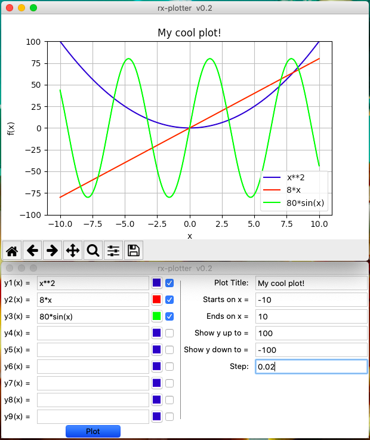

# [rX] Plotter

It's a python software you can use to plot mathematical functions into graphics. Works as a king of GUI to sympy.

Requires: sympy

## Features
- Up to 9 functions
- Selectable plots 
- Selectable color
- Customizable Title
- Customizable range and step

## Screenshots

